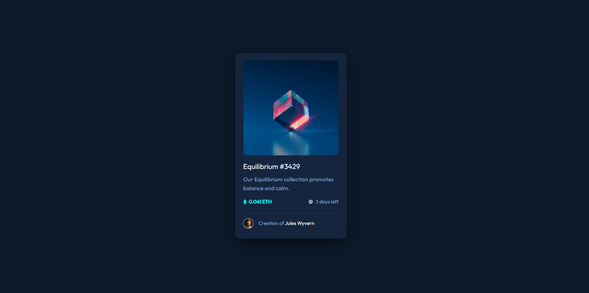

# Frontend Mentor - NFT preview card component solution

This is a solution to the [NFT preview card component challenge on Frontend Mentor](https://www.frontendmentor.io/challenges/nft-preview-card-component-SbdUL_w0U). Frontend Mentor challenges help you improve your coding skills by building realistic projects. 

## Table of contents

- [Overview](#overview)
  - [The challenge](#the-challenge)
  - [Screenshot](#screenshot)
  - [Links](#links)
- [My process](#my-process)
  - [Built with](#built-with)
  - [What I learned](#what-i-learned)
  - [Continued development](#continued-development)
  - [Useful resources](#useful-resources)
- [Author](#author)
- [Acknowledgments](#acknowledgments)

## Overview

### The challenge

Users should be able to:

- View the optimal layout depending on their device's screen size
- See hover states for interactive elements

### Screenshot



### Links

- Solution URL: (https://github.com/sillysavant/NFT-preview-card)
- Live Site URL: (https://sillysavant.github.io/NFT-preview-card/)

## My process

### Built with

- Semantic HTML5 markup
- CSS custom properties
- Flexbox
- CSS Grid
- Mobile-first workflow
- [React](https://reactjs.org/) - JS library
- [Next.js](https://nextjs.org/) - React framework
- [Styled Components](https://styled-components.com/) - For styles

**Note: These are just examples. Delete this note and replace the list above with your own choices**

### What I learned

The hardest part was to style the box-shadow attribute since I haven't learned much about it. The rest is pretty much just dividing each component into different containers and style those.

```css
.card{
    background-color: hsl(216, 50%, 16%);
    width: min(87.5%, 22rem);
    margin: 9.5rem auto;
    border-radius: 15px;
    padding: 1.5rem 1.6rem 2rem;
    box-shadow: 0 1rem 3rem rgba(0, 0, 0, 0.5);
}
```

### Continued development

This has been so much easier for me than the first challenge since I'm getting the hang of it. I'll continue to participate in these challenges since they're really fun and my now effort can be useful for the future as I could reuse these as templates.

### Useful resources

- https://www.youtube.com/c/TheNetNinja - Great youtube channel with inspiring lessons

## Author

- Frontend Mentor - [@yourusername](https://www.frontendmentor.io/profile/sillysavant)
